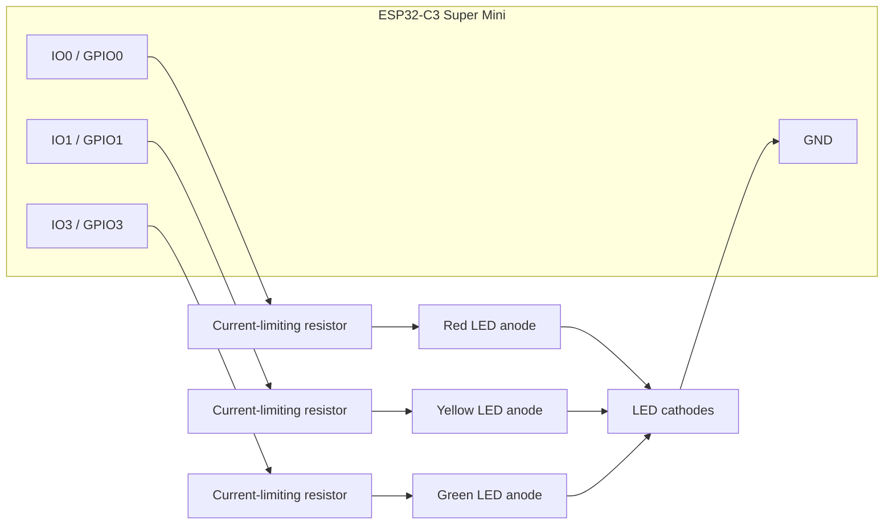

# ESP32-C3 Super Mini Pinout

This document is the source of truth for the ESP32-C3 Super Mini pin layout used by the AI Agent Status Light prototype.

## LED Pin Mapping

| Function | ESP32-C3 Super Mini pin | GPIO | Current behavior |
| --- | --- | ---: | --- |
| Red LED | IO0 | GPIO 0 | Busy / error |
| Yellow LED | IO1 | GPIO 1 | Waiting / thinking / connecting |
| Green LED | IO3 | GPIO 3 | Idle / connected |

## Wiring Diagram



## Firmware Constants

The firmware should define the LED pins as:

```cpp
const int redLed = 0;
const int yellowLed = 1;
const int greenLed = 3;
```

## Electrical Assumptions

The current firmware assumes active-high LED control:

```cpp
digitalWrite(redLed, HIGH); // LED on
digitalWrite(redLed, LOW);  // LED off
```

That means:

- GPIO `HIGH` turns the LED on.
- GPIO `LOW` turns the LED off.
- Each LED requires a current-limiting resistor.
- LED grounds must return to ESP32-C3 Super Mini `GND`.
- The PCB should expose clear test points or pads for red, yellow, green, 3.3V, and GND where practical.

## Prototype Wiring

For breadboard or hand-wired prototypes:

```text
ESP32-C3 Super Mini IO0 / GPIO0 -> resistor -> red LED anode
ESP32-C3 Super Mini IO1 / GPIO1 -> resistor -> yellow LED anode
ESP32-C3 Super Mini IO3 / GPIO3 -> resistor -> green LED anode
LED cathodes -> GND
```

## ESP32-C3 Super Mini Pin Notes

- Do not use GPIO2, GPIO8, or GPIO9 for the status LEDs. They are ESP32-C3 strapping / boot-related pins and external LED loads can make boot or flashing unreliable.
- Leave GPIO20 and GPIO21 free for UART unless there is a deliberate reason to repurpose the serial console pins.
- GPIO4 through GPIO7 and GPIO10 remain available for future expansion, but may conflict with JTAG/SPI expectations on some boards and firmware setups.

## PCB Notes

For the custom PCB:

- Keep the GPIO mapping stable unless there is a strong PCB-layout reason to change it.
- If the mapping changes, update this file, the firmware constants, and the manufacturing test procedure together.
- Label the LED outputs on the schematic and PCB silkscreen where possible.
- Add current-limiting resistors to the schematic/BOM.
- Choose resistor values based on LED forward voltage, brightness target, and ESP32-C3 GPIO current limits.
- Avoid overdriving GPIO pins directly. If final LEDs require more current than safe GPIO drive, use transistor/MOSFET drivers.
- Define whether the final design is active-high or active-low before production.

## Manufacturing Test Expectations

Every assembled unit should pass a basic LED test:

1. Turn all LEDs off.
2. Turn red on through GPIO0.
3. Turn yellow on through GPIO1.
4. Turn green on through GPIO3.
5. Confirm no LED channel is swapped.
6. Confirm no LED stays permanently on or off.
7. Confirm `/status?state=idle` turns green solid.
8. Confirm `/status?state=waiting` blinks yellow.
9. Confirm `/status?state=busy` turns red solid.

## Change Control

Pin changes affect:

- ESP32-C3 Super Mini firmware.
- PCB schematic.
- PCB layout.
- Functional test fixture.
- Manufacturing test procedure.
- Documentation.

Do not change the pin mapping casually after EVT. If pin changes are required, assign a new hardware revision.
