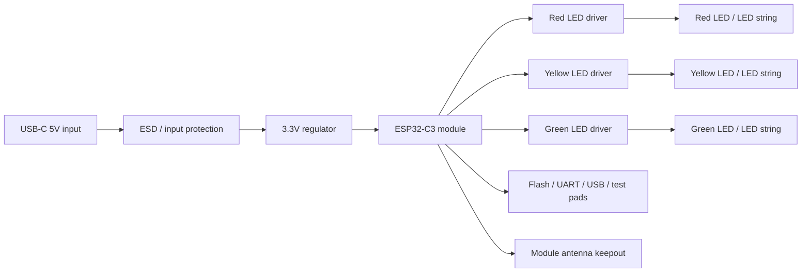

# PCBA Design And Manufacturing Guide

## TLDR

The safest path is to turn the working prototype into a custom PCBA in stages, not all at once.

Use an ESP32-C3 module on the first custom board, not a bare ESP32 chip. Keep the existing LED GPIO mapping unless there is a strong reason to change it. Design the board around USB power, stable 3.3V regulation, correct LED current control, reliable Wi-Fi antenna placement, exposed programming pads, and a simple production test fixture.

Do not start mass production from the first PCB revision. Build EVT boards first, fix electrical and firmware issues, then build DVT boards that fit the enclosure, then run a PVT pilot using the same files, test jig, firmware flashing flow, labels, and packaging expected in production.

The minimum PCBA release package should include:

- Schematic PDF and native design files.
- PCB layout files.
- Gerbers.
- Drill files.
- BOM with manufacturer part numbers and approved alternates.
- CPL / pick-and-place file.
- Assembly drawing.
- PCB stackup and impedance notes if USB data is used.
- Test point map.
- Firmware flashing instructions.
- Functional test procedure.
- Hardware revision notes.
- Known risks and allowed substitutions.

The board is not ready for production until every unit can be flashed, powered, tested, identified by serial/version, and rejected or passed using a repeatable fixture.

## Goal

This document explains how to design and manufacture the custom PCBA for the AI Agent Status Light after the prototype is already working on an off-the-shelf ESP32 board.

The objective is not just to make a smaller board. The objective is to create an electronics design that can be built repeatedly by a supplier with predictable cost, predictable quality, stable Wi-Fi behavior, stable USB power, and a factory test process.

This guide assumes the product is:

- A USB-powered desktop traffic light.
- Built around an ESP32-C3 class Wi-Fi microcontroller.
- Controlled by local HTTP endpoints.
- Discovered by a desktop app over Wi-Fi/mDNS/subnet scan/manual IP.
- Using red, yellow, and green LED channels.
- Intended for indoor desk use.

The current prototype pin mapping is documented in [ESP32-C3 Super Mini Pinout](./esp32-pinout.md). Treat that as the source of truth unless a new hardware revision explicitly changes it.

## Recommended Architecture

Use this architecture for the first production-intent PCBA:



Recommended first custom board:

- ESP32-C3 certified module, such as an ESP32-C3-MINI or similar module, not a bare SoC.
- USB-C receptacle for 5V power.
- 3.3V regulator sized for ESP32 Wi-Fi current peaks plus LED load.
- Three LED channels using direct GPIO only if current is low, otherwise transistor or MOSFET drivers.
- Clearly labeled test pads for power, ground, LED outputs, reset, boot/strap if needed, and flashing/debug.
- Board outline and mounting holes designed with the enclosure from the beginning.

Avoid a bare ESP32 chip in the first custom PCBA. A module reduces RF layout risk, antenna tuning risk, assembly risk, and compliance risk.

## Development Stages

### Stage 0: Freeze The Working Prototype

Before starting the schematic, freeze what already works.

Document:

- Firmware version.
- LED pin mapping.
- Active-high or active-low LED behavior.
- Startup LED pattern.
- Wi-Fi setup flow.
- HTTP endpoints.
- `/info` response format.
- mDNS name.
- USB power source used during testing.
- LED type, resistor values, and measured brightness if known.
- Any reset/setup button behavior.
- Known prototype problems.

Create photos of the prototype wiring and enclosure. Keep one working prototype as the reference unit.

Do not change firmware behavior, pin mapping, board architecture, and enclosure architecture at the same time. If too many things change between revisions, failures become hard to diagnose.

### Stage 1: EVT PCBA

EVT means Engineering Validation Test.

Goal:

- Prove the custom electronics work.
- Prove the selected ESP32 module boots and flashes reliably.
- Prove USB power is stable.
- Prove LED outputs are correct.
- Prove Wi-Fi range is acceptable in a representative enclosure.
- Prove the desktop app can discover and control the device.

Recommended quantity:

- 5-20 boards.

EVT boards may use a simplified enclosure or exposed PCB. They should still use production-intent power, LED, USB, and flashing circuits.

EVT pass criteria:

- Board boots every time from USB power.
- Firmware flashing is repeatable.
- Red, yellow, and green channels are not swapped.
- LED brightness is acceptable through the planned lenses or diffuser.
- Setup hotspot starts when no Wi-Fi credentials exist.
- Device connects to Wi-Fi.
- `/info` returns valid JSON.
- `/status` states work.
- Desktop discovery works.
- No overheating.
- No unexpected resets during Wi-Fi activity.
- Wi-Fi range is acceptable on a desk.

### Stage 2: DVT PCBA

DVT means Design Validation Test.

Goal:

- Prove the full product design works as a system.
- Confirm board fit, mounting, cables, connector access, lenses, LED alignment, and antenna placement inside the enclosure.

Recommended quantity:

- 20-100 units.

DVT boards should be close to production intent:

- Final or near-final board outline.
- Final or near-final USB connector location.
- Final mounting holes and screw clearances.
- Final LED placement and light blocking.
- Final antenna position relative to plastic and metal parts.
- Final test pads.
- Final label area or serial number process.

DVT pass criteria:

- PCBA fits enclosure without stress.
- USB cable inserts cleanly.
- LED lenses align correctly.
- Light leakage between red/yellow/green is acceptable.
- Antenna is not blocked by metal, ground pour, screws, labels, or decorative parts.
- Reset/setup access works if included.
- Unit survives repeated plug/unplug cycles.
- Unit passes a small pre-compliance check if available.
- Assembly time and fixture access are acceptable.

### Stage 3: PVT PCBA

PVT means Production Validation Test.

Goal:

- Prove the supplier can build the board consistently using production files and production process.

Recommended quantity:

- 100-500 units.

PVT must use:

- Released schematic.
- Released PCB files.
- Released BOM.
- Released firmware.
- Released flashing process.
- Released test fixture.
- Released assembly SOP.
- Released labels and serial number format.

PVT pass criteria:

- Production line can flash every board.
- Production line can run the functional test without engineering help.
- Defects are recorded by failure type.
- Failed units are separated.
- Rework is controlled.
- Yield is acceptable.
- Random sample units pass founder testing in Kosovo.
- Third-party inspection or supplier QC report is acceptable.

## Schematic Design

### ESP32 Module

Use a pre-certified ESP32-C3 module for the first commercial board.

Design requirements:

- Follow the module reference schematic.
- Expose required flashing and debug signals.
- Follow module power decoupling recommendations.
- Respect antenna keepout requirements.
- Keep boot/strapping pins free from loads that can break startup.
- Keep the module part number stable after EVT unless there is a supply issue.

Why module-first:

- Lower RF design risk.
- Easier assembly.
- Better supplier familiarity.
- Better chance of using existing module certifications as part of the compliance path.
- Faster debugging because the radio subsystem is already validated by the module vendor.

Bare ESP32 design should be considered only after:

- Product demand is proven.
- Annual volume justifies the engineering effort.
- You have access to RF layout review.
- You are prepared for more compliance testing risk.

### GPIO Mapping

Prototype mapping:

| Function | Prototype GPIO |
| --- | ---: |
| Red LED | GPIO0 |
| Yellow LED | GPIO1 |
| Green LED | GPIO3 |

Keep this mapping for the first custom board if possible.

Avoid casual pin changes because they affect:

- Firmware constants.
- PCB layout.
- Factory test jig.
- Test instructions.
- Debug notes.
- Support documentation.

If pin changes are required, assign a new hardware revision and update [ESP32-C3 Super Mini Pinout](./esp32-pinout.md), firmware, and test procedure together.

### USB Power Input

Use USB-C for the product unless there is a strong mechanical or cost reason not to.

Minimum USB-C requirements for a 5V sink device:

- Connect VBUS to the 5V input path.
- Connect GND to board ground.
- Add the correct CC pull-down resistors on CC1 and CC2 so USB-C chargers/cables know the device is a sink.
- Add input capacitance appropriate for the regulator and USB hot-plug behavior.
- Add ESD protection where practical, especially if USB data is connected.
- Ensure the connector has mechanical support through shield tabs, through-hole stakes, or strong pads.

Decide whether USB data is needed:

- Power-only USB is simpler for the user if firmware updates happen over Wi-Fi or test pads.
- USB data is useful for flashing, logs, factory programming, and recovery.
- If USB data is routed, follow USB D+/D- layout guidance and add ESD protection.

For early production, USB data is useful even if end users never use it. It can simplify factory flashing and field recovery.

### 3.3V Power Rail

The ESP32 needs a stable 3.3V rail, especially during Wi-Fi transmit bursts.

Design requirements:

- Regulator input from USB 5V.
- 3.3V output with enough current headroom for ESP32 peaks and LED load.
- Bulk capacitance near the regulator.
- Local decoupling near the ESP32 module power pins.
- Short, low-impedance power paths.
- Thermal margin at maximum expected LED brightness.

Practical target:

- Size the 3.3V regulator for at least 500 mA available output unless measurement proves a lower limit is safe.
- Keep LED current out of the ESP32 3.3V rail if using 5V LED strings or higher brightness LED assemblies.
- Test with weak USB power sources, long USB cables, and repeated Wi-Fi reconnects.

Common failure modes:

- Board boots on a bench supply but resets on a cheap USB charger.
- Wi-Fi works until all LEDs are on.
- Regulator overheats inside the enclosure.
- Brownout happens during Wi-Fi connection.

### LED Drive Circuit

Choose the LED circuit based on brightness and LED count.

#### Option A: Direct GPIO Drive

Use only for low-current indicator LEDs.

Circuit:

```text
GPIO -> current-limiting resistor -> LED anode
LED cathode -> GND
```

Pros:

- Simple.
- Cheap.
- Matches the current prototype.

Cons:

- Limited current.
- Brightness may be too low through traffic-light lenses.
- Total GPIO current limits can be exceeded if LEDs are overdriven.

Use this only if measured brightness is acceptable and current stays comfortably within the ESP32 module limits.

#### Option B: Low-Side MOSFET Or Transistor Driver

Use this for production if LEDs need more current, multiple LEDs per color, or more brightness consistency.

Typical low-side MOSFET circuit:

```text
5V or 3.3V -> resistor -> LED / LED string -> MOSFET drain
MOSFET source -> GND
GPIO -> gate resistor -> MOSFET gate
gate pulldown -> GND
```

Pros:

- Protects ESP32 GPIO pins from LED current.
- Allows brighter LED channels.
- Allows multiple LEDs per color.
- Easier to tune brightness per color.

Cons:

- More parts.
- Active-high/active-low behavior must be documented.
- Needs correct MOSFET selection at 3.3V gate drive.

Recommended production default:

- Use low-side MOSFET drivers if the final light needs real traffic-light brightness through lenses.
- Keep PWM brightness control available in firmware even if v1 uses on/off states.
- Use separate resistor values per LED color because red/yellow/green forward voltages and perceived brightness differ.

### LED Resistor Selection

For each LED channel:

```text
resistor_ohms = (supply_voltage - led_forward_voltage - driver_voltage_drop) / target_current
```

Example:

```text
5V supply
green LED forward voltage: 2.1V
target current: 10 mA
driver drop: near 0V for a small MOSFET

resistor = (5.0 - 2.1) / 0.010 = 290 ohms
```

Choose the nearest standard value and test brightness through the real lens.

Do not tune brightness only on a bare LED in open air. The enclosure, lens tint, diffuser, viewing angle, and light leakage matter more than the bare LED appearance.

### Reset, Boot, And Recovery

Include a reliable recovery path.

Recommended:

- Reset pad or button.
- Boot/flash pad if required by the flashing method.
- USB data or UART pads for firmware flashing.
- Test pads reachable by pogo pins before final assembly.

If a physical user reset button is included, define exactly what it does:

- Short press: restart.
- Long press: clear Wi-Fi credentials and return to setup hotspot.

If there is no user button, define a software or app-based reset path and keep a factory recovery path.

### Test Points

Add test points in the schematic and layout from revision 1.

Minimum test points:

| Signal | Purpose |
| --- | --- |
| GND | Fixture reference |
| 5V/VBUS | USB input check |
| 3V3 | Regulator check |
| EN/RST | Reset control |
| BOOT/strap if needed | Flash mode control |
| TX/RX or USB D+/D- | Flashing/logging |
| Red LED output | LED test |
| Yellow LED output | LED test |
| Green LED output | LED test |

Good test points:

- Are large enough for pogo pins.
- Are on one side of the board if possible.
- Are not hidden after the PCBA is installed.
- Have enough spacing for the fixture.
- Are labeled in the assembly drawing.

Do not wait until PVT to add test pads. The test fixture should evolve with the board.

### Protection And Reliability

Consider:

- USB ESD protection.
- Reverse or over-voltage protection if using nonstandard power inputs.
- Input fuse or resettable fuse if risk justifies it.
- Series resistor or ESD protection on exposed buttons or connectors.
- Adequate creepage/clearance around connector shield and mounting hardware.

This product is low-voltage USB powered, but poor input protection can still create returns, failed boards, or damaged laptops.

## PCB Layout

### Board Shape And Mechanical Fit

Start layout with the enclosure constraints:

- Board outline.
- Mounting holes.
- Screw boss clearances.
- USB connector position.
- LED positions.
- Lens spacing.
- Light barriers between colors.
- Antenna location.
- Pogo-pin fixture access.
- Product label or serial label area.

Use a STEP model of the enclosure as soon as possible. If the enclosure is still hand-built, create a temporary mechanical reference drawing with critical dimensions.

The PCBA should not depend on wires unless wires are intentionally part of the product. Wires add labor, assembly mistakes, and failure points.

### Antenna Placement

The antenna is one of the highest-risk layout areas.

Rules:

- Put the module antenna at the board edge when the module reference design expects it.
- Keep copper, traces, ground pour, screws, brackets, batteries, metal weights, and decorative metal away from the antenna keepout.
- Do not place the antenna under a metalized sticker, foil label, or metal enclosure part.
- Keep the plastic enclosure around the antenna as simple as possible.
- Test Wi-Fi range in the real enclosure orientation.

If the enclosure shape forces poor antenna placement, change the mechanical design before production.

### Layer Count

Recommended:

- Use 4 layers for the production-intent board if cost allows.

Typical 4-layer stack:

1. Top: components and signals.
2. Inner 1: solid ground plane.
3. Inner 2: power and signals.
4. Bottom: signals and test pads.

Why 4 layers:

- Better ground return paths.
- Better RF behavior around the module.
- Easier USB routing if data is used.
- Lower noise.
- Easier manufacturing consistency.

Two layers can work for a simple board, especially with a module, but it gives less margin for USB, power integrity, and RF cleanliness.

### Power Layout

Power layout rules:

- Keep regulator input and output loops short.
- Place regulator capacitors close to the regulator pins.
- Use wide traces or pours for 5V and 3.3V.
- Keep the ESP32 module decoupling close.
- Avoid routing LED current through narrow traces shared with the ESP32 supply.
- Connect grounds with a low-impedance ground plane.

Test the finished board with:

- All LEDs on.
- Wi-Fi connecting.
- HTTP requests sent repeatedly.
- Long USB cable.
- Low-quality USB power source.
- Enclosure closed.

### USB Data Layout

If USB D+/D- is routed:

- Route D+ and D- as a matched pair.
- Keep the pair short.
- Avoid stubs.
- Avoid crossing plane splits.
- Place ESD protection near the connector.
- Keep the pair away from noisy LED switching paths.
- Ask the PCB vendor for impedance guidance if the route is long or the stackup is controlled.

For short internal routes on a small board, perfect impedance is less critical than clean routing, no stubs, and sane ESD placement. Still, route it intentionally.

### LED Layout

LED layout must be driven by the enclosure.

Define:

- LED center positions.
- Distance from LED to lens.
- Lens material and tint.
- Diffuser requirement.
- Light-blocking walls between red/yellow/green.
- Viewing angle.
- Acceptable brightness.
- Acceptable color bleed.

Test multiple LED styles:

- Through-hole 5 mm LEDs.
- SMD LEDs with light pipes.
- Side-firing LEDs if the enclosure needs them.
- Multiple LEDs per color if lenses are large.

Do not let the PCB vendor choose LEDs without approval. LED color, brightness, viewing angle, and lens compatibility define the product feel.

### Silkscreen And Labels

Add practical silkscreen:

- Hardware revision, for example `AI-LIGHT-PCBA Rev A`.
- USB orientation marker if useful.
- Test point labels.
- LED channel labels.
- Pin 1 markers on ICs and connectors.
- Factory date/lot code area if needed.

Avoid:

- Decorative silkscreen under components.
- Tiny labels that cannot be read.
- Labels that will be hidden if the factory needs them during assembly/test.

## BOM Strategy

The BOM should be controlled, not improvised.

For every component, include:

- Reference designator.
- Quantity.
- Value.
- Package.
- Manufacturer.
- Manufacturer part number.
- Supplier part number if using JLCPCB/LCSC/DigiKey/Mouser/etc.
- Lifecycle status if known.
- Approved alternates.
- Whether substitution is allowed.
- Notes for critical parts.

Critical parts:

- ESP32 module.
- USB-C connector.
- 3.3V regulator.
- MOSFET/transistor LED drivers.
- LEDs.
- ESD protection.
- Buttons.
- Any connector or cable.

Noncritical parts:

- Some passives may allow alternates if value, tolerance, voltage rating, package, and temperature rating match.

Set substitution rules:

```text
No substitution without written approval:
- ESP32 module
- USB connector
- 3.3V regulator
- LEDs
- MOSFET/transistor drivers
- ESD protection

Approved alternates allowed:
- Passive resistors/capacitors matching value, tolerance, voltage, package, and temperature rating
```

## Design For Manufacturing

### Assembly Style

Prefer SMT parts wherever possible.

Through-hole parts are acceptable when they solve a mechanical or optical problem, such as 5 mm LEDs or a stronger connector, but they add process complexity.

Avoid:

- Mixed SMT and through-hole unless needed.
- Hand-soldered wires.
- Tiny parts that small-batch suppliers struggle with.
- Parts available from only one obscure supplier.
- Components placed too close to board edges, screws, or enclosure walls.

### Panelization

Ask the PCB assembler how they want the boards panelized.

Define:

- Board outline.
- Rails if needed.
- Fiducials.
- Tooling holes.
- Breakaway tabs or V-cuts.
- Keepout around USB connector and antenna.

Do not let panel tabs or rails interfere with:

- USB connector overhang.
- Antenna keepout.
- LED lens alignment.
- Test pads.
- Mounting holes.

### Fiducials

Add fiducials for SMT assembly:

- Global fiducials on the board or panel.
- Local fiducials if the assembler requests them for fine-pitch parts.
- Keep them clear of solder mask and silkscreen.

### DFM Review

Before ordering EVT boards, send the design to the PCBA supplier for DFM review.

Ask them to check:

- Minimum trace/space.
- Drill sizes.
- Annular rings.
- Solder mask slivers.
- Component spacing.
- Polarity markings.
- Footprint availability.
- USB connector manufacturability.
- LED assembly process.
- Panelization.
- Test point access.
- BOM availability.

Do not treat DFM feedback as automatic approval to change the design. Review each suggested change against firmware, enclosure, and test impact.

## Manufacturing File Package

Create one versioned folder per hardware release:

```text
ai-light-pcba-rev-a/
  01_schematic/
  02_pcb/
  03_fabrication/
  04_assembly/
  05_bom/
  06_firmware/
  07_test/
  08_mechanical/
  09_release_notes/
```

Minimum contents:

```text
01_schematic/
  ai-light-pcba-rev-a-schematic.pdf

03_fabrication/
  gerbers.zip
  drill.zip
  board-outline.pdf
  stackup-notes.txt

04_assembly/
  assembly-drawing-top.pdf
  assembly-drawing-bottom.pdf
  cpl-pick-place.csv
  centroid-file.csv
  polarity-notes.pdf

05_bom/
  bom-rev-a.xlsx
  approved-alternates.xlsx

06_firmware/
  firmware-version.txt
  flashing-instructions.md
  firmware.bin

07_test/
  test-point-map.pdf
  functional-test-procedure.md
  pass-fail-report-template.xlsx

08_mechanical/
  pcba-step-model.step
  enclosure-interface-drawing.pdf

09_release_notes/
  release-notes-rev-a.md
  known-issues.md
```

Every quote and purchase order should reference the exact release folder/version.

## Factory Flashing Process

Define the flashing process before PVT.

The factory should be able to:

1. Place the PCBA in a fixture.
2. Connect pogo pins, USB, or UART.
3. Flash the firmware.
4. Write or read the device serial/MAC.
5. Verify firmware version.
6. Run the functional test.
7. Print or apply serial label if needed.
8. Save pass/fail result.

Flashing instructions should include:

- Required tool.
- Operating system if relevant.
- USB/UART adapter type if used.
- Baud rate if used.
- Boot mode steps.
- Firmware file name.
- Firmware version.
- Expected success output.
- Expected failure behavior.
- Recovery steps.

Do not rely on one engineer's laptop as the only flashing station.

## Functional Test Fixture

The PCBA should be designed so every production unit can be tested quickly.

### Fixture Inputs

The fixture needs:

- USB power.
- Flashing connection if separate from USB.
- Network setup method or test firmware.
- Way to observe LED channels.
- Optional current measurement.
- Optional button actuator.

### Fixture Outputs

The fixture should record:

- Serial number or MAC.
- Hardware revision.
- Firmware version.
- 5V input pass/fail.
- 3.3V rail pass/fail.
- Red LED pass/fail.
- Yellow LED pass/fail.
- Green LED pass/fail.
- Wi-Fi or radio startup pass/fail.
- HTTP endpoint pass/fail if tested after network setup.
- Final result.

### Practical Test Flow

Use this as the first production test script:

1. Insert PCBA into fixture.
2. Apply USB power.
3. Confirm 3.3V rail is in range.
4. Flash firmware.
5. Read firmware version and MAC.
6. Run startup LED pattern.
7. Turn red on, yellow off, green off.
8. Turn yellow on, red off, green off.
9. Turn green on, red off, yellow off.
10. Turn all LEDs on briefly.
11. Turn all LEDs off.
12. Start Wi-Fi setup or test access point mode.
13. Confirm `/info` if the test network path is available.
14. Confirm `/status?state=idle`.
15. Mark unit pass or fail.

For early EVT, the test can be manual. For PVT, it should be scripted enough that a factory operator can run it repeatedly.

## LED And Optical Validation

The PCBA is not complete until the LED system is validated inside the enclosure.

Test:

- Brightness in normal office light.
- Brightness in a dark room.
- Side viewing angle.
- Color consistency.
- Light leakage between colors.
- Startup animation readability.
- Blink rate visibility.
- Heat after 8 hours powered.
- Whether red/yellow/green are distinguishable for color-impaired users.

If the product feels too dim:

- Increase LED current within safe limits.
- Use a brighter LED bin.
- Use multiple LEDs per color.
- Improve lens/diffuser design.
- Shorten LED-to-lens distance.
- Use a more transparent lens material.

If colors bleed:

- Add internal light walls.
- Move LEDs closer to lenses.
- Add black plastic separators.
- Reduce brightness.
- Change LED viewing angle.

## Wi-Fi Validation

Wi-Fi must be tested in the real enclosure.

Test cases:

- Device on a desk next to a laptop.
- Device 5-10 meters from router.
- Device behind a monitor.
- Device near USB hubs and metal laptop stands.
- Device inside the final enclosure.
- Device powered by a laptop USB port.
- Device powered by a wall charger.
- Device reconnecting after router restart.
- Device reconnecting after USB unplug/replug.

Pass criteria:

- Setup hotspot appears reliably.
- Device joins Wi-Fi reliably.
- Desktop discovery finds the device.
- HTTP control has acceptable latency.
- No frequent disconnects in normal desk use.

If Wi-Fi is weak:

- Move the module antenna to a better board edge.
- Remove copper or metal near the antenna.
- Change enclosure material near the antenna.
- Avoid placing the antenna against a monitor stand or weighted metal base.
- Test a module variant with external antenna only if the enclosure and compliance plan can support it.

## Enclosure Interface

The PCBA and enclosure must be designed together.

Define:

- Board mounting method.
- Screw size.
- Screw boss dimensions.
- Board thickness.
- USB connector opening.
- LED-to-lens distance.
- Lens retention method.
- Internal light blockers.
- Reset/setup button access.
- Heat path.
- Antenna keepout.
- Assembly sequence.
- Service/rework sequence.

Recommended assembly sequence:

1. PCBA is flashed and tested.
2. LED/lens alignment is visually checked.
3. PCBA is screwed or clipped into enclosure.
4. Enclosure is closed.
5. Final product test is run.
6. Serial/product label is applied.
7. Unit is packed.

Do not design the enclosure so the board must be bent, forced, or wired in place by hand.

## Compliance Preparation

This is not legal advice. Confirm final requirements with a qualified compliance lab before selling.

For PCBA design, compliance preparation means:

- Use a module with available regulatory documentation where possible.
- Preserve the module antenna layout guidance.
- Do not change RF components on the module.
- Keep records of schematic, PCB, BOM, firmware, labels, and user instructions.
- Keep production units traceable by hardware revision and lot.
- Run pre-compliance checks before a large production batch.

Likely compliance work:

- FCC planning for the US.
- CE/RED planning for the EU because the product uses Wi-Fi.
- RoHS material declarations.
- WEEE obligations if selling into EU markets.
- Country-of-origin and product labeling.

Using a certified ESP32 module reduces risk, but it does not automatically make the final product compliant. The final enclosure, antenna placement, power design, PCB layout, firmware, and labels still matter.

## Prototype Supplier Flow

Use a PCBA prototype supplier for EVT:

- JLCPCB.
- Seeed Fusion.
- PCBWay.
- Elecrow.

Send:

- Gerbers.
- BOM.
- CPL.
- Assembly notes.
- LED polarity drawing.
- ESP32 module placement notes.
- Test point map.
- Firmware flashing request if they support it.

Ask:

- Which parts are not available?
- Which parts need alternates?
- Which footprints create assembly risk?
- Can they assemble the USB connector?
- Can they assemble through-hole LEDs if used?
- Can they run AOI?
- Can they do functional testing?
- Can they ship samples to Kosovo?

For EVT, speed and learning matter more than perfect unit cost.

## Production Supplier Flow

After EVT/DVT, choose a production PCBA supplier.

Supplier must support:

- SMT assembly.
- Through-hole or hand assembly if the design requires it.
- ESP32 module sourcing and handling.
- Firmware flashing.
- Functional test fixture.
- AOI inspection.
- Traceability.
- Rework process.
- Written nonconforming-material process.
- Controlled substitutions.

Do not approve a supplier for production unless they can explain:

- How they will source the ESP32 module.
- How they will prevent LED polarity mistakes.
- How they will flash firmware.
- How they will test every LED channel.
- How they will test USB power.
- How they will record failures.
- How they will separate failed units from passed units.

## RFQ Pack For PCBA

Send suppliers a controlled RFQ pack.

Include:

- One-page product summary.
- Target quantities: EVT, DVT, PVT, first production.
- Schematic PDF.
- Gerbers.
- BOM with approved alternates.
- CPL / pick-and-place.
- Assembly drawings.
- PCBA photos/renders if available.
- Test point map.
- Flashing requirements.
- Functional test requirements.
- Packaging requirement for bare PCBAs.
- Required lead time.
- Shipping destination for samples.

Ask suppliers to quote separately:

- PCB fabrication.
- SMT assembly.
- Through-hole assembly.
- Components.
- ESP32 module.
- Firmware flashing.
- Functional testing.
- Fixture cost.
- Engineering/NRE cost.
- Sample shipping.

## Acceptance Criteria By Build

### EVT Acceptance

Accept EVT if:

- At least 80% of boards pass basic electrical bring-up without rework.
- Every failed board has a clear failure category.
- At least one board passes the full firmware and desktop discovery flow.
- No fundamental architecture change is required.

Reject or revise EVT if:

- Boards do not boot consistently.
- USB power is unstable.
- ESP32 cannot be flashed reliably.
- LED channels are swapped or too dim due to architecture.
- Wi-Fi is poor because of board/enclosure placement.

### DVT Acceptance

Accept DVT if:

- Board fits the enclosure.
- LED optics pass.
- Wi-Fi passes in the enclosure.
- Factory flashing path is proven.
- Test pads are reachable.
- Pre-compliance scan has no severe surprises.
- BOM supply is acceptable.

Reject or revise DVT if:

- PCBA requires hand modification to fit.
- USB connector alignment is poor.
- Antenna is blocked.
- LEDs look wrong through the lenses.
- Factory cannot test the board repeatably.

### PVT Acceptance

Accept PVT if:

- Supplier builds using released files.
- Factory test process works.
- Yield is acceptable.
- Defects are documented.
- Random samples pass founder testing.
- Units are traceable by revision/lot/serial.

Reject or pause production if:

- Supplier substitutes critical parts without approval.
- Failed units are mixed with passed units.
- Test records are missing.
- Yield is poor and root cause is unclear.
- Product behavior differs from the golden sample.

## Revision Control

Use explicit hardware revisions:

- Rev A: first custom EVT PCBA.
- Rev B: DVT fixes.
- Rev C: production candidate.

Every revision should have:

- Change log.
- Reason for change.
- Affected files.
- Firmware compatibility note.
- Test fixture compatibility note.
- Known issues.

Example:

```text
Rev B changes:
- Moved USB-C connector 1.2 mm toward board edge for enclosure fit.
- Changed red LED resistor from 330 ohm to 220 ohm for lens brightness.
- Added pogo pad for GPIO3 LED test.
- No firmware pin changes.
- Compatible with Rev A flashing fixture except pogo pin 6 moved.
```

Do not allow invisible revisions. If a supplier changes the PCB, BOM, LED bin, USB connector, or module variant, the revision notes must change.

## Common Mistakes To Avoid

- Moving from breadboard directly to 1000 units.
- Using a bare ESP32 chip before the module version is stable.
- Forgetting USB-C CC resistors.
- Relying on GPIO pins for too much LED current.
- Changing LED pins without updating firmware and test procedure.
- Placing copper or metal under the module antenna.
- Hiding test pads after enclosure assembly.
- Treating LED brightness as an electrical problem only.
- Letting the supplier substitute LEDs without optical approval.
- Skipping a functional test fixture.
- Accepting boards with no serial, lot, or revision tracking.
- Ordering injection-molded enclosures before PCBA/antenna fit is proven.
- Assuming module certification equals finished product certification.

## Founder Bring-Up Checklist

Use this checklist when the first custom PCBAs arrive in Kosovo:

1. Photograph packaging and board condition before powering anything.
2. Inspect solder joints, USB connector, LEDs, and module orientation.
3. Check for visible solder bridges or missing parts.
4. Measure resistance between 5V and GND before plugging in.
5. Power from a current-limited bench supply if available.
6. Measure 3.3V rail.
7. Confirm no regulator overheating.
8. Flash firmware.
9. Read serial/MAC/log output.
10. Run LED channel test.
11. Run setup hotspot flow.
12. Connect to Wi-Fi.
13. Call `/info`.
14. Call every `/status` state.
15. Test desktop discovery.
16. Test repeated power cycles.
17. Test inside enclosure.
18. Record failures with photos and board serial/MAC.

## PCBA Release Checklist

Do not release a PCBA to production until this checklist is complete:

- Schematic reviewed.
- PCB layout reviewed.
- ESP32 antenna keepout reviewed.
- USB-C circuit reviewed.
- Power rail measured under load.
- LED currents measured.
- Thermal behavior checked inside enclosure.
- Test pads reachable.
- Firmware flashing verified.
- Functional test written.
- BOM alternates approved.
- Supplier DFM feedback reviewed.
- EVT issues closed or accepted.
- DVT fit and optical issues closed.
- Golden sample approved.
- Compliance lab consulted.
- Release folder archived.
- Purchase order references exact PCBA revision.

## Source Notes

- The current prototype GPIO mapping and manufacturing test expectations are defined in [ESP32-C3 Super Mini Pinout](./esp32-pinout.md).
- Device behavior, endpoints, and LED states are defined in [AI Agent Status Light Device Plan](./device.md).
- Supplier selection, EVT/DVT/PVT gates, compliance planning, and final assembly are covered in [Manufacturing Plan](./manufacturing.md).
- Use the ESP32 module vendor's datasheet, hardware design guidelines, and reference schematic as controlling documents for schematic, layout, power, boot, and antenna requirements.
